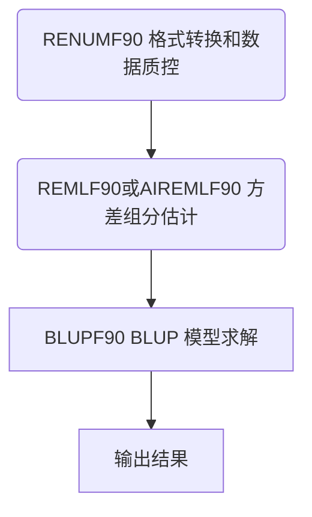

    
  微信公众号：房子下面一头猪    

    

本期内容简介  

遗传评估软件BLUPF90的基本介绍与使用教程

- [1. 基础知识](#1-基础知识)  
  - [1.1 BLUP模型](#11-blup模型)  
    - [1.1.1 ABLUP模型](#111-ablup模型)  
    - [1.1.2 GBLUP模型](#112-gblup模型)  
    - [1.1.3 一步法(ssGBLUP)模型](#113-一步法ssgblup模型)  
  - [1.2 混合亲缘关系矩阵H](#12-混合亲缘关系矩阵h)  
- [2. 软件概况](#2-软件概况)  
- [2.1 发展历史](#21-发展历史)  
- [2.2 使用权限](#22-使用权限)  
- [2.3 支持平台](#23-支持平台)  
- [2.4 软件模块](#24-软件模块)  
- [2.5 使用流程（遗传评估）](#25-使用流程遗传评估)  
- [3. 程序文件](#3-程序文件)  
  - [3.1 数据文件](#31-数据文件)  
    - [3.1.1 数据文件整体要求](#311-数据文件整体要求)  
    - [3.1.2 表型数据文件](#312-表型数据文件)  
    - [3.1.3 系谱数据文件](#313-系谱数据文件)  
    - [3.1.4 基因组数据文件](#314-基因组数据文件)  
  - [3.2 参数文件](#32-参数文件)  
    - [3.2.1 参数文件整体要求](#321-参数文件整体要求)  
    - [3.2.2 必要参数](#322-必要参数)  
      - [**DATAFILE**](#datafile)  
      - [**TRAITS**](#traits)  
      - [**FIELDS\_PASSED TO OUTPUT**](#fields_passed-to-output)  
      - [**WEIGHT(S)**](#weights)  
      - [**RESIDUAL\_VARIANCE**](#residual_variance)  
      - [**EFFECT**](#effect)  
    - [3.2.3 可选参数](#323-可选参数)  
      - [**RANDOM**](#random)  
      - [**FILE**](#file)  
      - [**FILE\_POS**](#file_pos)  
      - [**SNP\_FILE**](#snp_file)  
      - [**PED\_DEPTH**](#ped_depth)  
      - [**(CO)VARIANCES**](#covariances)  
    - [效应定义小结](#效应定义小结)  
      - [固定效应](#固定效应)  
      - [加性效应](#加性效应)  
      - [永久性随机环境效应](#永久性随机环境效应)  
    - [额外参数](#额外参数)  
  - [3.3 结果文件](#33-结果文件)  
    - [3.3.1 重编码结果文件](#331-重编码结果文件)  
  - [3.3.2 评估结果文件](#332-评估结果文件)  
- [4. 实践示例](#4-实践示例)

# 1. 基础知识  
  
## 1.1 BLUP模型  
  
### 1.1.1 ABLUP模型  
  
ABLUP模型是一种基于**系谱**的混合线性模型，用**A矩阵**来计算育种值  
  
$$\left[\begin{array}{cc}  
\mathbf{X}^{\prime} \mathbf{X} & \mathbf{X}^{\prime} \mathbf{Z} \\  
\mathbf{Z}^{\prime} \mathbf{X} & \mathbf{Z}^{\prime} \mathbf{Z}+\mathbf{{\color{Red} A} }^{-1} \boldsymbol{\alpha}  
\end{array}\right]\left[\begin{array}{l}  
\mathbf{b} \\  
\mathbf{u}  
\end{array}\right]=\left[\begin{array}{l}  
\mathbf{X}^{\prime} \mathbf{y} \\  
\mathbf{Z}^{\prime} \mathbf{y}  
\end{array}\right]$$  
  
### 1.1.2 GBLUP模型  
  
GBLUP模型是一种基于**分子标记**的混合线性模型，用**G矩阵**来计算育种值  
  
$$\left[\begin{array}{cc}  
\mathbf{X}^{\prime} \mathbf{X} & \mathbf{X}^{\prime} \mathbf{Z} \\  
\mathbf{Z}^{\prime} \mathbf{X} & \mathbf{Z}^{\prime} \mathbf{Z}+\mathbf{{\color{Red} G} }^{-1} \boldsymbol{\alpha}  
\end{array}\right]\left[\begin{array}{l}  
\mathbf{b} \\  
\mathbf{u}  
\end{array}\right]=\left[\begin{array}{l}  
\mathbf{X}^{\prime} \mathbf{y} \\  
\mathbf{Z}^{\prime} \mathbf{y}  
\end{array}\right]$$  
  
### 1.1.3 一步法(ssGBLUP)模型  
  
- 一步法模型与BLUP一致，但随机效应的（协）方差结构不一致  
- 使用**混合亲缘关系矩阵H**代替加性亲缘关系矩阵A阵，同时使用**系谱和基因组**信息求解  
  
$$\left[\begin{array}{cc}  
\mathbf{X}^{\prime} \mathbf{X} & \mathbf{X}^{\prime} \mathbf{Z} \\  
\mathbf{Z}^{\prime} \mathbf{X} & \mathbf{Z}^{\prime} \mathbf{Z}+\mathbf{{\color{Red} H} }^{-1} \boldsymbol{\alpha}  
\end{array}\right]\left[\begin{array}{l}  
\mathbf{b} \\  
\mathbf{u}  
\end{array}\right]=\left[\begin{array}{l}  
\mathbf{X}^{\prime} \mathbf{y} \\  
\mathbf{Z}^{\prime} \mathbf{y}  
\end{array}\right]$$  
  
## 1.2 混合亲缘关系矩阵H  
  
其实质为利用基因组信息调整未基因分型个体的亲缘关系  
  
$$\mathbf{H}^{-1}=\mathbf{A}^{-1}+\left[\begin{array}{cc}  
\mathbf{0} & \mathbf{0} \\  
\mathbf{0} & \mathbf{G}^{-1}-\mathbf{A}_{22}^{-1}  
\end{array}\right]$$    

$$\mathbf{A}_{22}:基因分型个体组成的A阵$$  

   
  
$$\begin{array}{ccc}  
\hline \text { Animal } & \text { Sire } & \text { Dam } \\  
\hline 1 & 0 & 0 \\  
2 & 0 & 0 \\  
{\color{Red} 3}  & 1 & 2 \\  
{\color{Red} 4}  & 1 & 2 \\  
\hline  
\end{array}  
\left[\begin{array}{cccc}  
1.0 & 0.0 & 0.5 & 0.5 \\  
\cdot & 1.0 & 0.5 & 0.5 \\  
. & . & 1.0 & 0.5 \\  
. & . & . & 1.0  
\end{array}\right]\\  
{\color{Red} \left[\begin{array}{cc}  
1.0 & 0.52 \\  
. & 1.0  
\end{array}\right]}\left[\begin{array}{cccc}  
1.004 & 0.0 & 0.507 & 0.507 \\  
. & 1.004 & 0.507 & 0.507 \\  
\cdot & . & {\color{Red} 1.0 } &{\color{Red}  0.52}  \\  
. & . &{\color{Red}  . } &{\color{Red}  1.0}   
\end{array}\right]$$

$$\text{系谱  A矩阵   G矩阵  H矩阵}$$  
  
# 2. 软件概况  
  
# 2.1 发展历史  
  
1997年由佐治亚大学的 _Ignacy Misztal_ 开发，最初是为了课程教学，时至今日仍在不断更新，Linux版本最新版**2023-01-25**发布  
  
# 2.2 使用权限  
  
- **研究使用**：免费使用，但需在论文中引用  
- **商业使用**：需申请商业授权  
  
# 2.3 支持平台  
  
- Linux, Mac OSX, Windows  
- 推荐使用[Linux版本](http://nce.ads.uga.edu/html/projects/programs/)  
  
  
  
# 2.4 软件模块  
  
- 不同功能分模块提供，每个模块提供一个可执行文件  
- 本次主要介绍**遗传评估**部分  
- 完整模块信息可参阅[application_programs[BLUPF90]](http://nce.ads.uga.edu/wiki/doku.php?id=application_programs)  
  
  
  
# 2.5 使用流程（遗传评估）  
  

_<u>请注意，已知方差组分时可省略方差组分估计步骤</u>_  
  
  
# 3. 程序文件  
  
## 3.1 数据文件  
  
### 3.1.1 数据文件整体要求  
  
- 不应具有标题行  
- 不应出现字符`#`  
- 使用空格作为分隔符，连续的多个空格将被视为一个分隔  
  - 不能使用制表符`TAB`作为分隔符  
- 对于Linux平台，确保文件换行符为`LR (\n)`  
  - 可以使用`dos2unix`命令修改window平台创建的文件  
  
### 3.1.2 表型数据文件  
  
- 个体编码可以包含**字母**和**数字**  
- 缺失值可任意指定  
- 整型和浮点型变量无强制**顺序**  
  - DMU要求整型在前  
  
$$\begin{matrix}  
整型&&&实型&&&\\  
345&1&69&20.3&1.08004&0.952123&1.45443\\  
346&2&27&26.7&0.99726&1.01302&1.13901\\  
347&2&43&19.5&1.08285&0.900454&1.33243\\  
348&2&2&22.2&1.02697&1.01719&0.92849\\  
349&1&218&17.3&1.05095&0.958695&1.42519\\  
350&2&17&18.1&1.0204&1.05445&0.384847\\  
351&2&57&25.6&0.95566&0.947974&2.06488\\  
352&2&36&20.6&1.01382&0.921759&1.59988\\  
353&1&550&17.3&1.01025&0.99182&1.11917\\  
354&2&66&16.3&1.00517&0.993156&0.815969  
\end{matrix}$$  
  
### 3.1.3 系谱数据文件  
  
- 个体编码可以包含**字母**和**数字**  
- 系谱可以包含个体、父亲、母亲、受体母亲、出生年  
- 信息列之间无顺序要求，可以通过参数指定  
- 个体信息列必须包含在系谱中  
- **默认系谱**为：个体、父亲、母亲三列（有顺序）  
- **未知个体**使用0表示，不可修改  
  
$$\begin{matrix}  
子代&父&母\\  
1000&124&297\\  
1001&95&267\\  
1002&169&341\\  
1003&19&191\\  
1004&124&297\\  
1005&56&228\\  
1006&55&227\\  
1007&95&267\\  
1008&105&278\\  
1009&121&294\\  
\end{matrix}$$  
  
### 3.1.4 基因组数据文件  
  
- 基因组文件为经过调整的**012**格式  
- 以0、1、2表示双等位基因座中次要等位基因的数量，5表示缺失  
- 等位基因之间不能具有空格  
- 等位基因应该从每行的相同位置起始  
- 长度不同的ID需要用**空格补齐**  
  

  
## 3.2 参数文件  
  
### 3.2.1 参数文件整体要求  
  
- 参数文件以关键字和值的**键值对**形式指定  
- 关键字为全大写，占据单独一行，不应具有其他内容  
- 部分关键字有严格的**顺序**要求  
- 参数文件中可以包含`#`引导的注释  
- 完整的参数列表可以参阅[用户手册](http://nce.ads.uga.edu/wiki/lib/exe/fetch.php?media=blupf90_all8.pdf)  
  
> DATAFILE   
> data.txt  
> TRAITS  
> 4  
> FIELDS_PASSED TO OUTPUT  
> 1  
> WEIGHT(S)  
>   
> RESIDUAL_VARIANCE  
>    1.9004  
> EFFECT  
> 2 cross alpha    # 1st effect fixed (sex)  
> EFFECT  
> 3 cross alpha    # 2nd effect random (litter)  
> RANDOM  
> diagonal  
> (CO)VARIANCES  
>    3.2708  
> EFFECT           # 3rd effect random (animal)  
> 1 cross alpha  
> RANDOM  
> animal  
> FILE  
> pedigree.txt  
> FILE_POS  
> 1 2 3  
> SNP_FILE  
> genotypes.txt  
> PED_DEPTH  
> 0  
> (CO)VARIANCES  
>    1.4373  
  
### 3.2.2 必要参数  
  
- 参数文件必须包含六个关键字，且需在参数文件开始时，按如下顺序指定：  
  
  - DATAFILE  
  - TRAITS  
  - FIELDS_PASSED TO OUTPUT  
  - WEIGHT(S)  
  - RESIDUAL_VARIANCE  
  - EFFECT  
  
#### **DATAFILE**  
  
- 表型数据文件名  
  - 文件名中不应包含字符`#`  
  - 可以使用绝对路径或者相对路径  
  
- 格式  
> DATAFILE  
> F1  
  
- 示例  
> DATAFILE  
> data.txt  
  
#### **TRAITS**  
  
- 待评估的性状在表型数据文件中的列位置  
  - 多个待评估的性状以空格分隔  
  
- 格式  
> TRAITS  
> t1 t2 t3  
  
- 示例  
> TRAITS  
> 4  
  
或  
  
> TRAITS  
> 4 5  
  
#### **FIELDS_PASSED TO OUTPUT**  
  
- 在结果文件中额外输出原始编码  
  - 默认输出为重编码后的数据  
  - 可以指定多列  
  - 无需指定以空行表示  
  
- 格式  
> FIELDS_PASSED TO OUTPUT  
> p1 p2 .. pm  
  
- 示例  
> FIELDS_PASSED TO OUTPUT  
>    
  
#### **WEIGHT(S)**  
  
- 加权数值在表型数据文件中的列数  
  - 无需指定以空行表示  
  
- 格式  
> WEIGHT(S)  
> w  
  
- 示例  
> WEIGHT(S)  
>    
  
#### **RESIDUAL_VARIANCE**  
  
- 残差的方差协方差矩阵  
  - 根据调用的模块不同，可能作为先验值或真值  
  - 矩阵的阶数和待评估的性状相同  
  
- 格式  
> RESIDUAL_VARIANCE  
> R  
  
- 示例  
> RESIDUAL_VARIANCE  
> 1 0  
> 0 1  
  
#### **EFFECT**  
  
**最关键的参数**  
  
- e1 e2 e3 …  
  - 效应在表型数据文件中的列数  
  - 指定列数的数量和待评估的性状相同  
  
- type：变量类型  
  - cross：分类变量  
  - cov：协变量  
- form：变量格式  
  - alpha：字符型  
  - num：数值型  
  
  - _<u>请注意，变量类型为协变量时，变量格式默认为数值型</u>_  
  
- 格式  
> EFFECT  
> e1 e2 e3 ... type form  
  
- 示例  
> EFFECT  
> 2 cross alpha  
  
或  
  
> EFFECT  
> 2 2 cov num  
  
  
### 3.2.3 可选参数  
  
- 可选参数的**指定位置**：紧随特定参数之后或必要参数后的任意位置  
- 可选参数仅为程序运行可选，部分参数的有无会影响到分析的**模型和方法**  
- 部分可选参数之间也有相互顺序  
  
#### **RANDOM**  
  
**必须在EFFECT参数后**  
  
- 指定EFFECT为随机效应  
  - 定义随机效应的方差-协方差矩阵  
    - diagonal: 随机效应  
    - sire : 父系效应  
    - animal : 动物效应（加性效应）  
  
- 格式  
> RANDOM  
> random_type  
  
- 示例  
> RANDOM  
> diagonal  
  
#### **FILE**  
  
**必须在RANDOM后指定**  
  
**RANDOM必须为sire或animal**  
  
- 指定系谱文件  
  - 可以使用绝对路径或者相对路径  
  
- 格式  
> FILE  
> fped  
  
- 示例  
> FILE  
> pedigree.txt  
  
#### **FILE_POS**  
  
必须在**FILE**后指定  
  
- 定义系谱文件列信息  
  - 个体、父亲、母亲、受体母亲、出生年份在系谱文件中的列数，信息必须按如上顺序  
  - 默认1 2 3 0 0  
  
- 格式  
> FILE_POS  
> animal sire dam alt_dam yob  
  
- 示例  
> FILE_POS  
> 1 2 3  
  
#### **SNP_FILE**  
  
必须在**FILE**或**FILE_POS**后指定  
  
- 指定**基因组文件**  
  
该参数指定后，评估将从ABLUP改为**ssGBLUP**  
  
- 可以使用绝对路径或者相对路径  
  
- 格式  
> SNP_FILE  
> fsnp  
  
- 示例  
> SNP_FILE  
> genotypes.txt  
  
#### **PED_DEPTH**  
  
必须在**FILE**、**FILE_POS**或**SNP_FILE**后指定  
  
- 定义追溯的系谱深度  
  - 默认：3  
  - 使用全部系谱：0  
  
- 格式  
> PED_DEPTH  
> p  
  
- 示例  
> PED_DEPTH  
> 0  
  
#### **(CO)VARIANCES**  
  
必须在**RANDOM**、**FILE**、**FILE_POS**、**SNP_FILE**或**PED_DEPTH**后指定  
  
- 定义随机效应先验方差-协方差时，根据调用的模块不同，可能作为先验值或真值  
  - 矩阵的阶数和待评估的性状数相同  
  
- 格式  
> (CO)VARIANCES  
> G  
  
- 示例  
> (CO)VARIANCES  
> 1 0  
> 0 1  
  
### 效应定义小结  
  
- 效应参数按照如下顺序，可以省略，但不可改变顺序  
  - EFFECT  
  - RANDOM  
  - FILE  
  - FILE_POS  
  - SNP_FILE  
  - PED_DEPTH  
  - (CO)VARIANCES  
  
- 效应指定的更多参数可以参阅[用户手册](http://nce.ads.uga.edu/wiki/lib/exe/fetch.php?media=blupf90_all8.pdf)  
  
#### 固定效应  
  
> EFFECT  
> 2 cross alpha  
  
#### 加性效应  
  
> EFFECT  
> alpha1 cross  
> RANDOM  
> animal  
> FILE  
> pedigree.txt  
> FILE POS  
> 1 2 3  
> SNP FILE  
> genotypes.txt  
> PED DEPTH  
> 0  
> (CO)VARIANCES  
>    1.4373  
  
  
#### 永久性随机环境效应  
  
> EFFECT  
> 3 cross alpha  
> RANDOM  
> diagonal  
> (CO)VARIANCES  
>     3.2708  
  
### 额外参数  
  
- 不影响分析过程的核心  
- 以OPTION开始，每行定义一个  
- 均有默认值  
- 参数可能仅对特定模块有效  
- 相互之间没有顺序要求。  
  
- OPTION missing 0  
  - 设定缺失值  
- OPTION conv_crit 1e-10  
  - 设定收敛标准  
- OPTION maxrounds 5000  
  - 设定最大迭代次数  
- OPTION solv_method PCG  
  - 设定求解方法（FSPAK, SOR, PCG）  
- OPTION sol se  
  - 计算标准误差（求解方法强制为FSPAK，忽略OPTION solv_method ）  
- OPTION use_yams  
  - 使用YAMS进行分析  
  
- 格式  
> OPTION alpha_size nn  
  
- 示例  
> OPTION alpha_size 20  
  
## 3.3 结果文件  
  
### 3.3.1 重编码结果文件  
  
**renf90.par**  
  
- 参数卡文件的重编码  
  
**renf90.dat**  
  
- 数据文件的重编码  
- 依次为性状的表型观察值，效应值，**重编码个体ID和原始个体ID**  
  
$$\begin{matrix}  
20.3&1&499&320&345\\  
26.7&2&185&177&346\\  
19.5&2&359&31&347\\  
22.2&2&108&1763&348\\  
17.3&1&128&1615&349\\  
18.1&2&76&1841&350\\  
25.6&2&486&108&351\\  
20.6&2&284&256&352\\  
17.3&1&483&402&353\\  
16.3&2&496&547&354  
\end{matrix}$$  
  
**renaddxx.ped**  
  
- 系谱文件的重编码  
- xx表示加性效应在renf90.par中的效应编号  
  – **第一列**：重编码的个体ID  
  – **第二列**：重编码的父亲ID  
  – **第三列**：重编码的母亲ID  
  – **第十列**：原始的个体ID  
  
$$\begin{matrix}  
13&1994&2167&1&0&12&1&0&0&864\\  
14&1989&2162&1&0&12&1&0&0&771\\  
15&2022&2195&1&0&12&1&0&0&1994\\  
16&2007&2180&1&0&12&1&0&0&545\\  
17&1975&2147&1&0&12&1&0&0&638\\  
18&2042&2215&1&0&12&1&0&0&1030\\  
19&2031&2204&1&0&12&1&0&0&1628\\  
20&2022&2195&1&0&12&1&0&0&524\\  
21&1935&2107&1&0&12&1&0&0&1171\\  
22&1915&2087&1&0&12&1&0&0&431  
\end{matrix}$$  
  
## 3.3.2 评估结果文件  
  
**solutions**  
  
- 性状编号  
- 效应值编号  
- 效应值编码  
- **估计值**  
- 标准误差  
  
$$\begin{matrix}  
&trait/effect&&level&solution&s.e.\\  
&1&1&1&18.31150856&0.14902612\\  
&1&1&2&22.37736186&0.14442008\\  
&1&2&1&0.60449305&1.19110868\\  
&1&2&2&1.71355593&1.20550974\\  
&1&2&3&1.31711199&0.81010172\\  
&1&2&4&-0.40327058&0.99353224\\  
&1&2&5&0.36696138&0.67554892\\  
&1&2&6&0.28910708&0.86487151\\  
&1&2&7&0.02916631&0.80314085\\  
&1&2&8&0.59193558&0.87613780  
\end{matrix}$$  
  
# 4. 实践示例  
  
运行步骤  
  
- **数据整理**：renumf90 test.par | tee renumf90.log  
- **运算**：blupf90 renf90.par | tee blupf90.log  
  
实际运行材料和参数卡可以在**公众号后台**回复关键字“**BLUPF90**”获取  

    

文章配套教程视频及其他平台文章链接：  

[BLUPF90软件基本介绍](https://www.bilibili.com/video/BV1cg4y1W7Yv/)  

[BLUPF90软件基本介绍]()  

 

供稿：卓越、李伟宁    
编辑：李思雨   
校对：李伟宁   

---  
  
团队其他公众平台：  
**微信公众号** | 房子下面一头猪  
**Bilibili** | [房子下面一头猪](https://space.bilibili.com/1521325260)  
**知乎** | [房子下面一头猪](https://www.zhihu.com/people/mang-guo-c-60-10)
